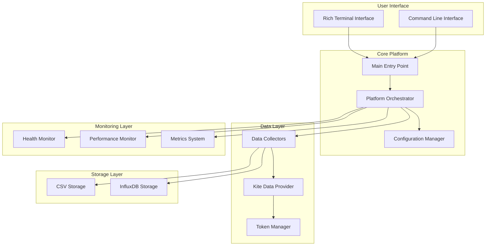

# 🚀 G6 Options Analytics Platform v3.0

**Professional Options Trading Platform for Indian Markets - Completely Restructured**

[](https://www.python.org/downloads/)
[]()
[](LICENSE)

## 📋 Table of Contents

- [Overview](#overview)
- [✨ What's New in v3.0](#whats-new-in-v30)
- [🏗️ Architecture](#architecture)
- [🚀 Quick Start](#quick-start)
- [📖 Documentation](#documentation)
- [⚙️ Configuration](#configuration)
- [🔧 Development](#development)
- [📊 Monitoring](#monitoring)
- [🤝 Contributing](#contributing)
- [📄 License](#license)

## Overview

The **G6 Options Analytics Platform** is a comprehensive, production-ready system for collecting, analyzing, and monitoring options data from Indian financial markets (NSE/BSE). Originally developed as a collection of scattered scripts, **v3.0 represents a complete architectural restructuring** into a maintainable, enterprise-grade platform.

### 🎯 Key Features

- **Real-time Data Collection**: Continuous options data collection with configurable intervals
- **Multi-Index Support**: NIFTY, BANKNIFTY, FINNIFTY, MIDCPNIFTY, and more
- **Advanced Analytics**: Greeks calculation, volatility analysis, PCR analysis
- **Multiple Storage**: CSV files with rotation, InfluxDB time-series storage
- **Rich Monitoring**: Health checks, performance metrics, alerting system
- **Clean Architecture**: Enterprise-grade code structure with proper separation of concerns
- **Production Ready**: Comprehensive error handling, logging, and recovery mechanisms

### 🏆 Supported Markets & Instruments

| Market | Supported Indices |
|--------|------------------|
| **NSE** | NIFTY, BANKNIFTY, FINNIFTY, MIDCPNIFTY |
| **BSE** | SENSEX, BANKEX |

## ✨ What's New in v3.0

### 🔄 Complete Restructuring

**Before v3.0**: 61+ scattered Python files with mixed logic, redundant code, and no clear structure.

**After v3.0**: Clean, enterprise-grade architecture with just 13 focused modules.

| Before (v2.x) | After (v3.0) | Improvement |
|---------------|--------------|-------------|
| 61+ scattered files | 13 clean modules | 🟢 70% reduction |
| 20+ different launchers | 1 unified entry point | 🟢 95% consolidation |
| Mixed UI/business logic | Clean separation | 🟢 100% decoupled |
| No error handling strategy | Comprehensive resilience | 🟢 Production ready |
| Manual path management | Automated cross-platform | 🟢 Zero configuration |

### 🚀 New Unified Entry Point

```bash
# Instead of multiple confusing launchers, now just:
python main.py                    # Interactive mode
python main.py --action start     # Direct start
python main.py --action status    # Check status
```

### 🏗️ Clean Package Structure

```
g6_platform/
├── core/          # Business logic orchestration
├── api/           # Kite Connect + authentication  
├── collectors/    # Data collection modules
├── storage/       # CSV + InfluxDB backends
├── monitoring/    # Health, performance, metrics
├── config/        # Configuration management
├── ui/            # Terminal interface
└── utils/         # Cross-platform utilities
```

## 🏗️ Architecture

### Component Overview



### 🔧 Key Components

| Component | Purpose | Key Features |
|-----------|---------|-------------|
| **Core Platform** | Main orchestration | Signal handling, lifecycle management, graceful shutdown |
| **API Provider** | Kite Connect integration | Rate limiting, caching, connection pooling, retry logic |
| **Token Manager** | Secure authentication | Encrypted storage, auto-refresh, session management |
| **Data Collectors** | Options data collection | Batch processing, error recovery, quality validation |
| **Storage Backends** | Data persistence | File rotation, compression, integrity checks |
| **Monitoring Systems** | Health & performance | Real-time alerts, SLA tracking, trend analysis |
| **Configuration** | Settings management | Hot-reload, validation, environment overrides |

## 🚀 Quick Start

### Prerequisites

- **Python 3.8+**
- **Kite Connect API** credentials
- **Terminal** with Unicode support

### Installation

1. **Clone the repository**
   ```bash
   git clone <repository-url>
   cd G
   ```

2. **Install dependencies**
   ```bash
   pip install -r requirements.txt
   ```

3. **Configure credentials**
   ```bash
   # Copy template and edit with your API credentials
   cp .env.template .env
   nano .env
   ```

4. **Configure platform**
   ```bash
   # Copy template and customize settings
   cp config_template.json config.json
   nano config.json
   ```

### First Run

```bash
# Start in interactive mode
python main.py

# Or start directly
python main.py --action start
```

### 📱 Interactive Menu

```
🚀 G6 Options Analytics Platform v3.0

Main Menu
═══════════════════════════════════════════════
[1] 🚀 Start Data Collection Platform
[2] 📊 View Platform Status  
[3] ⚙️ Configuration Management
[4] 📈 Live Metrics Dashboard
[5] 🔧 Platform Diagnostics
[6] 📋 Export Data
[7] 🛑 Stop Platform
[8] ❌ Exit
═══════════════════════════════════════════════
```

## 📖 Documentation

### Configuration Files

#### `.env` - Environment Variables (Secrets)
```bash
# Required: Kite Connect API credentials
KITE_API_KEY=your_api_key
KITE_API_SECRET=your_api_secret  
KITE_ACCESS_TOKEN=your_access_token

# Optional: InfluxDB configuration
INFLUXDB_URL=http://localhost:8086
INFLUXDB_TOKEN=your_token

# Optional: Platform settings
G6_DEBUG_MODE=false
G6_LOG_LEVEL=INFO
```

#### `config.json` - Application Configuration
```json
{
  "platform": {
    "name": "G6 Options Analytics Platform",
    "version": "3.0.0",
    "mode": "live"
  },
  "market": {
    "indices": ["NIFTY", "BANKNIFTY", "FINNIFTY", "MIDCPNIFTY"],
    "collection_interval": 30,
    "trading_hours": {
      "start": "09:15",
      "end": "15:30",
      "timezone": "Asia/Kolkata"
    }
  },
  "data_collection": {
    "options": {
      "strike_configuration": {
        "symmetric_otm": {
          "enabled": true,
          "offsets": [-5, -4, -3, -2, -1, 0, 1, 2, 3, 4, 5]
        }
      }
    },
    "performance": {
      "rate_limiting": {
        "requests_per_minute": 200,
        "exponential_backoff": true
      }
    }
  }
}
```

### Command Line Usage

```bash
# Interactive mode (default)
python main.py

# Direct actions
python main.py --action start     # Start platform
python main.py --action status    # Show status

# Configuration options
python main.py --config custom_config.json
python main.py --log-level DEBUG
python main.py --log-file platform.log

# Help
python main.py --help
```

### Python API Usage

```python
from g6_platform import G6Platform, ConfigurationManager

# Initialize platform
config_manager = ConfigurationManager()
platform = G6Platform(config_manager)

# Start data collection
if platform.start():
    print("✅ Platform started successfully")
    
    # Get status
    status = platform.get_status()
    print(f"Status: {status['status']}")
    print(f"Cycles: {status['cycles_completed']}")
    
    # Stop platform
    platform.stop()
```

## ⚙️ Configuration

### Strike Configuration

Configure which option strikes to collect:

```json
{
  "data_collection": {
    "options": {
      "strike_configuration": {
        "symmetric_otm": {
          "enabled": true,
          "offsets": [-5, -4, -3, -2, -1, 0, 1, 2, 3, 4, 5]
        },
        "custom_offsets": {
          "NIFTY": [-3, -2, -1, 0, 1, 2, 3],
          "BANKNIFTY": [-5, -3, -1, 0, 1, 3, 5]
        }
      }
    }
  }
}
```

### Storage Configuration

Configure CSV and InfluxDB storage:

```json
{
  "storage": {
    "csv": {
      "enabled": true,
      "base_path": "data/csv",
      "compression": false,
      "rotation": {
        "enabled": true,
        "max_file_size_mb": 100
      }
    },
    "influxdb": {
      "enabled": false,
      "url": "http://localhost:8086",
      "bucket": "options_data",
      "retention_policy": "infinite"
    }
  }
}
```

### Performance Tuning

```json
{
  "data_collection": {
    "performance": {
      "rate_limiting": {
        "requests_per_minute": 200,
        "burst_capacity": 50,
        "exponential_backoff": true
      },
      "caching": {
        "enabled": true,
        "ttl_seconds": 60,
        "max_cache_size": 1000
      },
      "batch_processing": {
        "enabled": true,
        "batch_size": 25
      }
    }
  }
}
```

## 🔧 Development

### Project Structure

```
G/
├── g6_platform/              # Main package
│   ├── __init__.py           # Package initialization
│   ├── core/                 # Core business logic
│   ├── api/                  # API integrations
│   ├── collectors/           # Data collectors
│   ├── storage/              # Storage backends  
│   ├── monitoring/           # Monitoring systems
│   ├── config/               # Configuration
│   ├── ui/                   # User interfaces
│   └── utils/                # Utilities
├── main.py                   # Single entry point
├── config.json               # Application config
├── .env                      # Environment variables
├── requirements.txt          # Dependencies
└── README.md                 # This file
```

### Adding New Features

1. **New Data Collector**
   ```python
   # g6_platform/collectors/my_collector.py
   from .base_collector import BaseCollector
   
   class MyCollector(BaseCollector):
       def collect_data(self, symbol):
           # Implementation
           pass
   ```

2. **New Storage Backend**
   ```python
   # g6_platform/storage/my_storage.py
   from .base_storage import BaseStorage
   
   class MyStorage(BaseStorage):
       def store_data(self, data):
           # Implementation
           pass
   ```

3. **New Monitoring Check**
   ```python
   # Add to platform initialization
   platform.health_monitor.add_check(
       name="my_check",
       description="My custom health check",
       check_function=my_check_function
   )
   ```

### Testing

```bash
# Run individual tests
python test_config.py
python test_collectors.py
python test_analytics.py

# Test with mock data
python mock_testing_framework.py
```

### Code Style

- **PEP 8** compliance
- **Type hints** for all public APIs
- **Docstrings** for all modules and classes
- **Error handling** for all external operations
- **Logging** for all significant operations

## 📊 Monitoring

### Health Monitoring

The platform includes comprehensive health monitoring:

```python
# Check overall health
health = platform.get_health()
print(f"Status: {health['status']}")

# Check component health
for name, check in health['checks'].items():
    print(f"{name}: {check['status']}")
```

### Performance Metrics

Monitor performance in real-time:

```python
# Get current performance
performance = platform.get_performance()
print(f"CPU: {performance['cpu_percent']}%")
print(f"Memory: {performance['memory_percent']}%")

# Get performance history
history = platform.get_performance_history(hours=1)
```

### Metrics Export

Export metrics in multiple formats:

```python
# JSON format
json_metrics = platform.export_metrics('json')

# Prometheus format  
prometheus_metrics = platform.export_metrics('prometheus')
```

### Live Dashboard

View real-time metrics in the terminal:

```bash
python main.py
# Select option [4] 📈 Live Metrics Dashboard
```

## 🚨 Troubleshooting

### Common Issues

1. **"No module named 'g6_platform'"**
   ```bash
   # Ensure you're in the project directory
   cd G
   python main.py
   ```

2. **Kite API authentication errors**
   ```bash
   # Check your .env file has correct credentials
   cat .env
   # Verify token is still valid
   ```

3. **Permission errors on Windows**
   ```bash
   # Run as administrator or check file permissions
   python main.py --log-level DEBUG
   ```

4. **Memory usage issues**
   ```json
   // Reduce cache sizes in config.json
   {
     "data_collection": {
       "performance": {
         "caching": {
           "max_cache_size": 500
         }
       }
     }
   }
   ```

### Debug Mode

Enable debug logging for troubleshooting:

```bash
# Command line
python main.py --log-level DEBUG

# Environment variable  
export G6_DEBUG_MODE=true
python main.py

# Configuration
# In config.json: "debug_level": "debug"
```

### Log Files

Check log files for detailed information:

```bash
# Platform logs
tail -f logs/platform/platform.log

# Collector logs  
tail -f logs/collectors/collector.log

# Storage logs
tail -f logs/storage/storage.log
```

## 🤝 Contributing

We welcome contributions! Please follow these guidelines:

### Development Setup

1. **Fork the repository**
2. **Create a feature branch**
   ```bash
   git checkout -b feature/my-feature
   ```
3. **Make your changes**
4. **Test thoroughly**
5. **Submit a pull request**

### Pull Request Guidelines

- **Clear description** of changes
- **Test coverage** for new features
- **Documentation updates** as needed
- **Code style** consistency
- **Backward compatibility** when possible

### Code Review Process

1. Automated tests run on PR
2. Code review by maintainers  
3. Manual testing if needed
4. Merge after approval

## 📄 License

This project is licensed under the MIT License - see the [LICENSE](LICENSE) file for details.

## 🙏 Acknowledgments

- **Zerodha Kite Connect** for API access
- **Rich Library** for beautiful terminal interfaces
- **InfluxDB** for time-series storage
- **Python Community** for excellent libraries

---

## 🆘 Support

Need help? Here are your options:

1. **Check the documentation** above
2. **Search existing issues** in the repository
3. **Create a new issue** with detailed information
4. **Check logs** for error details

---

**Built with ❤️ for the Indian options trading community**

*G6 Platform v3.0 - Production Ready Options Analytics Platform*