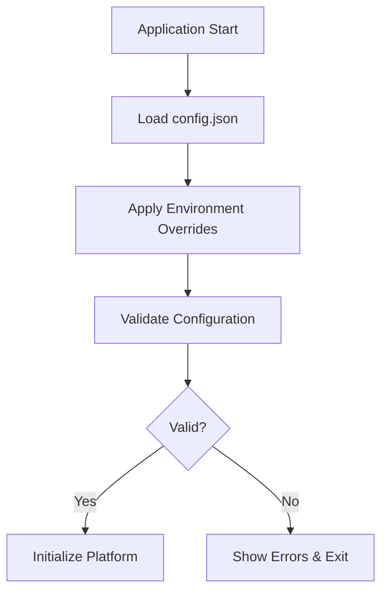

# G6.1 Platform Configuration Guide

## Overview

This guide provides comprehensive documentation for configuring the G6.1 Options Analytics Platform. The platform uses a hierarchical configuration system with JSON files and environment variable overrides.

## Table of Contents

1. [Configuration Architecture](#configuration-architecture)
2. [Configuration Files](#configuration-files)
3. [Environment Variables](#environment-variables)
4. [Configuration Sections](#configuration-sections)
5. [Advanced Configuration](#advanced-configuration)
6. [Validation and Troubleshooting](#validation-and-troubleshooting)
7. [Best Practices](#best-practices)

---

## Configuration Architecture

### Configuration Priority

The platform uses the following priority order (highest to lowest):

1. **Environment Variables** (Highest Priority)
2. **Command Line Arguments**
3. **config.json File**
4. **Default Values** (Lowest Priority)

### Configuration Flow



---

## Configuration Files

### Main Configuration File (`config.json`)

The primary configuration file located in the project root directory.

```json
{
  "platform": {
    "name": "G6.1 Options Analytics Platform",
    "version": "2.0.0",
    "mode": "live",
    "debug_enabled": false
  },
  "market": {
    "indices": ["NIFTY", "BANKNIFTY", "FINNIFTY", "MIDCPNIFTY"],
    "collection_interval": 30,
    "market_hours": {
      "start": "09:15",
      "end": "15:30",
      "timezone": "Asia/Kolkata"
    }
  },
  "data_collection": {
    "options": {
      "strike_configuration": {
        "symmetric_otm": {
          "enabled": true,
          "offsets": [-5, -4, -3, -2, -1, 0, 1, 2, 3, 4, 5]
        },
        "asymmetric_otm": {
          "enabled": false,
          "call_strikes": [0, 1, 2, 3, 4, 5],
          "put_strikes": [0, -1, -2, -3, -4, -5, -6, -7]
        },
        "custom_offsets": {
          "NIFTY": [-5, -4, -3, -2, -1, 0, 1, 2, 3, 4, 5],
          "BANKNIFTY": [-5, -3, -1, 0, 1, 3, 5],
          "SENSEX": [-4, -3, -2, -1, 0, 1, 2, 3, 4]
        }
      },
      "data_fields": {
        "basic": ["tradingsymbol", "strike", "expiry", "option_type", "last_price"],
        "pricing": ["volume", "oi", "change", "pchange", "iv", "average_price"],
        "ohlc": {
          "enabled": true,
          "fields": ["open", "high", "low", "close", "ohlc"]
        },
        "greeks": ["delta", "gamma", "theta", "vega"],
        "market_depth": {
          "enabled": false,
          "fields": ["bid", "ask", "bid_quantity", "ask_quantity"]
        }
      }
    },
    "performance": {
      "rate_limiting": {
        "requests_per_minute": 200,
        "burst_capacity": 50,
        "exponential_backoff": true,
        "max_retry_attempts": 3
      },
      "connection_pooling": {
        "enabled": true,
        "max_concurrent_requests": 10,
        "connection_timeout": 30,
        "read_timeout": 60
      },
      "caching": {
        "enabled": true,
        "ttl_seconds": 60,
        "max_cache_size": 1000,
        "cache_cleanup_interval": 300
      },
      "batch_processing": {
        "enabled": true,
        "batch_size": 25,
        "batch_timeout": 5
      }
    }
  },
  "storage": {
    "csv": {
      "enabled": true,
      "base_path": "data/csv",
      "compression": false,
      "backup": true,
      "rotation": {
        "enabled": false,
        "max_file_size_mb": 0,
        "retention_days": 0
      }
    },
    "influxdb": {
      "enabled": false,
      "url": "http://localhost:8086",
      "database": "g6_analytics",
      "retention_policy": "infinite",
      "measurement_prefix": "options_",
      "batch_size": 1000
    }
  },
  "ui": {
    "rich_terminal": {
      "enabled": true,
      "color_system": "auto",
      "width": 140,
      "theme": "default"
    },
    "logging": {
      "level": "INFO",
      "console_output": true,
      "file_output": true,
      "log_rotation": true
    }
  },
  "analytics": {
    "greeks_calculation": {
      "enabled": true,
      "avoid_redundancy": true,
      "calculation_frequency": "real_time"
    },
    "volatility_analysis": {
      "enabled": true,
      "calculation_methods": ["historical", "implied"],
      "window_size": 30
    },
    "pcr_analysis": {
      "enabled": true,
      "calculation_intervals": [5, 15, 30, 60]
    }
  }
}
```

### Environment Configuration File (`.env`)

Contains sensitive configuration that should not be version controlled.

```bash
# Kite Connect API Credentials (REQUIRED)
KITE_API_KEY=your_api_key_here
KITE_API_SECRET=your_api_secret_here
KITE_ACCESS_TOKEN=your_access_token_here

# Optional: InfluxDB Configuration
INFLUXDB_URL=http://localhost:8086
INFLUXDB_TOKEN=your_influxdb_token
INFLUXDB_ORG=g6_analytics

# Optional: Advanced Settings
G6_DEBUG_MODE=false
G6_MOCK_MODE=false
G6_LOG_LEVEL=INFO
G6_MAX_WORKERS=10

# Optional: Performance Tuning
G6_RATE_LIMIT_RPM=200
G6_CACHE_TTL=60
G6_BATCH_SIZE=25
```

---

## Environment Variables

### API Credentials

| Variable | Description | Required | Example |
|----------|-------------|----------|---------|
| `KITE_API_KEY` | Kite Connect API Key | Yes | `abcd1234` |
| `KITE_API_SECRET` | Kite Connect API Secret | Yes | `efgh5678` |
| `KITE_ACCESS_TOKEN` | Kite Connect Access Token | Yes | `ijkl9012` |

### Platform Settings

| Variable | Description | Default | Options |
|----------|-------------|---------|---------|
| `G6_DEBUG_MODE` | Enable debug mode | `false` | `true`, `false` |
| `G6_MOCK_MODE` | Use mock data sources | `false` | `true`, `false` |
| `G6_LOG_LEVEL` | Logging level | `INFO` | `DEBUG`, `INFO`, `WARNING`, `ERROR` |
| `G6_MAX_WORKERS` | Maximum worker threads | `10` | `1-50` |

### Performance Settings

| Variable | Description | Default | Range |
|----------|-------------|---------|-------|
| `G6_RATE_LIMIT_RPM` | Rate limit (req/min) | `200` | `50-500` |
| `G6_CACHE_TTL` | Cache TTL (seconds) | `60` | `10-3600` |
| `G6_BATCH_SIZE` | API batch size | `25` | `1-100` |

### Database Settings

| Variable | Description | Default | Example |
|----------|-------------|---------|---------|
| `INFLUXDB_URL` | InfluxDB URL | `http://localhost:8086` | `https://influxdb.example.com` |
| `INFLUXDB_TOKEN` | InfluxDB access token | - | `your_token_here` |
| `INFLUXDB_ORG` | InfluxDB organization | `g6_analytics` | `your_org` |

---

## Configuration Sections

### Platform Section

Controls core platform behavior.

```json
{
  "platform": {
    "name": "G6.1 Options Analytics Platform",
    "version": "2.0.0",
    "mode": "live",
    "debug_enabled": false
  }
}
```

**Settings:**

| Setting | Type | Description | Options |
|---------|------|-------------|---------|
| `name` | string | Platform display name | Any string |
| `version` | string | Platform version | Semantic version |
| `mode` | string | Operating mode | `live`, `paper`, `simulation` |
| `debug_enabled` | boolean | Enable debug logging | `true`, `false` |

### Market Section

Configures market data collection parameters.

```json
{
  "market": {
    "indices": ["NIFTY", "BANKNIFTY", "FINNIFTY", "MIDCPNIFTY"],
    "collection_interval": 30,
    "market_hours": {
      "start": "09:15",
      "end": "15:30",
      "timezone": "Asia/Kolkata"
    }
  }
}
```

**Settings:**

| Setting | Type | Description | Default |
|---------|------|-------------|---------|
| `indices` | array | Market indices to collect | `["NIFTY", "BANKNIFTY"]` |
| `collection_interval` | integer | Collection interval (seconds) | `30` |
| `market_hours.start` | string | Market start time (HH:MM) | `"09:15"` |
| `market_hours.end` | string | Market end time (HH:MM) | `"15:30"` |
| `market_hours.timezone` | string | Market timezone | `"Asia/Kolkata"` |

### Data Collection Section

Configures data collection behavior and performance.

#### Strike Configuration

```json
{
  "strike_configuration": {
    "symmetric_otm": {
      "enabled": true,
      "offsets": [-5, -4, -3, -2, -1, 0, 1, 2, 3, 4, 5]
    },
    "asymmetric_otm": {
      "enabled": false,
      "call_strikes": [0, 1, 2, 3, 4, 5],
      "put_strikes": [0, -1, -2, -3, -4, -5, -6, -7]
    },
    "custom_offsets": {
      "NIFTY": [-5, -4, -3, -2, -1, 0, 1, 2, 3, 4, 5],
      "BANKNIFTY": [-5, -3, -1, 0, 1, 3, 5]
    }
  }
}
```

**Strike Configuration Types:**

1. **Symmetric OTM**: Equal call and put strikes around ATM
2. **Asymmetric OTM**: Different call and put strike ranges
3. **Custom Offsets**: Index-specific strike configurations

#### Data Fields Configuration

```json
{
  "data_fields": {
    "basic": ["tradingsymbol", "strike", "expiry", "option_type", "last_price"],
    "pricing": ["volume", "oi", "change", "pchange", "iv", "average_price"],
    "ohlc": {
      "enabled": true,
      "fields": ["open", "high", "low", "close", "ohlc"]
    },
    "greeks": ["delta", "gamma", "theta", "vega"],
    "market_depth": {
      "enabled": false,
      "fields": ["bid", "ask", "bid_quantity", "ask_quantity"]
    }
  }
}
```

**Field Categories:**

- **Basic**: Essential option information
- **Pricing**: Price and volume data
- **OHLC**: Open/High/Low/Close data
- **Greeks**: Option Greeks (if available)
- **Market Depth**: Bid/ask data (disabled by default for performance)

#### Performance Configuration

```json
{
  "performance": {
    "rate_limiting": {
      "requests_per_minute": 200,
      "burst_capacity": 50,
      "exponential_backoff": true,
      "max_retry_attempts": 3
    },
    "connection_pooling": {
      "enabled": true,
      "max_concurrent_requests": 10,
      "connection_timeout": 30,
      "read_timeout": 60
    },
    "caching": {
      "enabled": true,
      "ttl_seconds": 60,
      "max_cache_size": 1000,
      "cache_cleanup_interval": 300
    },
    "batch_processing": {
      "enabled": true,
      "batch_size": 25,
      "batch_timeout": 5
    }
  }
}
```

**Performance Tuning:**

| Setting | Description | Recommended | Range |
|---------|-------------|-------------|-------|
| `requests_per_minute` | API rate limit | `200` | `50-500` |
| `burst_capacity` | Burst request allowance | `50` | `10-100` |
| `max_concurrent_requests` | Concurrent connections | `10` | `5-25` |
| `ttl_seconds` | Cache time-to-live | `60` | `30-300` |
| `batch_size` | API batch size | `25` | `10-50` |

### Storage Section

Configures data storage backends.

#### CSV Storage

```json
{
  "csv": {
    "enabled": true,
    "base_path": "data/csv",
    "compression": false,
    "backup": true,
    "rotation": {
      "enabled": false,
      "max_file_size_mb": 0,
      "retention_days": 0
    },
    "cleanup": {
      "enabled": false,
      "delete_old_files": false,
      "archive_old_files": true
    }
  }
}
```

#### InfluxDB Storage

```json
{
  "influxdb": {
    "enabled": false,
    "url": "http://localhost:8086",
    "database": "g6_analytics",
    "retention_policy": "infinite",
    "measurement_prefix": "options_",
    "batch_size": 1000,
    "retention_settings": {
      "duration": "0s",
      "replication": 1,
      "shard_duration": "168h",
      "delete_policy": "never"
    }
  }
}
```

### UI Section

Configures user interface behavior.

```json
{
  "ui": {
    "rich_terminal": {
      "enabled": true,
      "color_system": "auto",
      "width": 140,
      "theme": "default"
    },
    "web_dashboard": {
      "enabled": false,
      "host": "0.0.0.0",
      "port": 5000,
      "debug": false
    },
    "logging": {
      "level": "INFO",
      "console_output": true,
      "file_output": true,
      "log_rotation": true
    }
  }
}
```

---

## Advanced Configuration

### Custom Index Configuration

```json
{
  "custom_indices": {
    "CUSTOM_INDEX": {
      "symbol_mapping": "NSE:CUSTOM",
      "strike_interval": 25,
      "lot_size": 75,
      "tick_size": 0.05,
      "expiry_pattern": "monthly",
      "strike_offsets": [-10, -5, 0, 5, 10]
    }
  }
}
```

### Advanced Rate Limiting

```json
{
  "advanced_rate_limiting": {
    "priority_queues": {
      "CRITICAL": {
        "weight": 1.0,
        "max_queue_size": 100
      },
      "HIGH": {
        "weight": 0.7,
        "max_queue_size": 200
      },
      "NORMAL": {
        "weight": 0.5,
        "max_queue_size": 500
      },
      "LOW": {
        "weight": 0.3,
        "max_queue_size": 1000
      }
    },
    "circuit_breaker": {
      "enabled": true,
      "failure_threshold": 5,
      "recovery_timeout": 60,
      "half_open_max_calls": 3
    }
  }
}
```

### Alerting Configuration

```json
{
  "alerting": {
    "enabled": true,
    "channels": {
      "email": {
        "enabled": false,
        "smtp_server": "smtp.gmail.com",
        "smtp_port": 587,
        "username": "alerts@example.com",
        "recipients": ["admin@example.com"]
      },
      "webhook": {
        "enabled": false,
        "url": "https://hooks.slack.com/...",
        "timeout": 10
      }
    },
    "rules": {
      "high_error_rate": {
        "threshold": 5.0,
        "window_minutes": 5,
        "severity": "WARNING"
      },
      "api_rate_limit_exceeded": {
        "threshold": 1,
        "window_minutes": 1,
        "severity": "CRITICAL"
      }
    }
  }
}
```

---

## Validation and Troubleshooting

### Configuration Validation

The platform validates configuration on startup:

```python
from config.config_manager import validate_config, load_config

# Load and validate configuration
config = load_config('config.json')
errors = validate_config(config)

if errors:
    print("Configuration errors:")
    for error in errors:
        print(f"  - {error}")
else:
    print("Configuration is valid")
```

### Common Validation Errors

| Error | Cause | Solution |
|-------|-------|----------|
| "Missing required field: platform.name" | Platform name not specified | Add `"name"` to platform section |
| "Invalid collection_interval: must be positive" | Negative interval value | Set positive integer value |
| "Empty indices list" | No indices configured | Add at least one index to `indices` array |
| "Invalid market hours format" | Wrong time format | Use HH:MM format (e.g., "09:15") |
| "Invalid rate limiting configuration" | Rate limit settings invalid | Check requests_per_minute > 0 |

### Troubleshooting Configuration Issues

#### 1. Configuration File Not Found

```bash
Error: Configuration file 'config.json' not found
```

**Solution:**
- Ensure `config.json` exists in the project root
- Check file permissions (readable by application)
- Use absolute path if needed

#### 2. Invalid JSON Format

```bash
Error: Invalid JSON in configuration file
```

**Solution:**
- Validate JSON syntax using online validator
- Check for trailing commas
- Ensure all strings are quoted
- Verify bracket/brace matching

#### 3. Environment Variable Override Issues

```bash
Warning: Environment variable G6_DEBUG_MODE ignored (invalid value)
```

**Solution:**
- Check environment variable names (case sensitive)
- Verify boolean values are `true` or `false`
- Ensure numeric values are valid

#### 4. Permission Errors

```bash
Error: Permission denied accessing configuration file
```

**Solution:**
```bash
# Fix file permissions
chmod 644 config.json

# Fix directory permissions
chmod 755 config/
```

### Configuration Debugging

Enable debug mode to see configuration loading details:

```bash
export G6_DEBUG_MODE=true
python fixed_enhanced_launcher.py
```

Debug output will show:
- Configuration file loading
- Environment variable overrides
- Validation results
- Final merged configuration

---

## Best Practices

### 1. Security

#### Sensitive Data
- **Never commit API keys** to version control
- Use `.env` files for secrets
- Set appropriate file permissions (600 for .env)
- Use environment variables in production

#### Access Control
```bash
# Secure configuration files
chmod 600 .env
chmod 644 config.json
chown app:app config.json
```

### 2. Performance

#### Optimal Settings for Different Environments

**Development Environment:**
```json
{
  "data_collection": {
    "performance": {
      "rate_limiting": {
        "requests_per_minute": 100
      },
      "caching": {
        "ttl_seconds": 30
      },
      "batch_size": 10
    }
  }
}
```

**Production Environment:**
```json
{
  "data_collection": {
    "performance": {
      "rate_limiting": {
        "requests_per_minute": 200
      },
      "caching": {
        "ttl_seconds": 60
      },
      "batch_size": 25
    }
  }
}
```

### 3. Maintenance

#### Configuration Backup
```bash
# Create configuration backup
cp config.json config.json.backup.$(date +%Y%m%d)

# Restore from backup
cp config.json.backup.20241226 config.json
```

#### Version Control
- Version control `config.json`
- **Never** version control `.env`
- Use `.env.template` for environment structure
- Document configuration changes

#### Configuration Templates

Create environment-specific templates:

```bash
config/
├── config.json              # Default configuration
├── config.development.json  # Development overrides
├── config.production.json   # Production overrides
└── config.testing.json      # Testing configuration
```

### 4. Monitoring

#### Configuration Health Checks
```python
def validate_runtime_config():
    """Validate configuration at runtime."""
    config = load_config()
    
    # Check API connectivity
    if not test_api_connection(config):
        raise ConfigurationError("API connection failed")
    
    # Check storage paths
    if not validate_storage_paths(config):
        raise ConfigurationError("Storage paths invalid")
    
    # Check performance settings
    if not validate_performance_settings(config):
        raise ConfigurationError("Performance settings invalid")
```

#### Configuration Metrics
Track configuration-related metrics:
- Configuration load time
- Validation errors
- Environment override count
- Hot-reload frequency

---

## Configuration Schema

### JSON Schema Definition

```json
{
  "$schema": "http://json-schema.org/draft-07/schema#",
  "title": "G6.1 Platform Configuration",
  "type": "object",
  "required": ["platform", "market", "data_collection"],
  "properties": {
    "platform": {
      "type": "object",
      "required": ["name", "version", "mode"],
      "properties": {
        "name": {
          "type": "string",
          "minLength": 1
        },
        "version": {
          "type": "string",
          "pattern": "^\\d+\\.\\d+\\.\\d+$"
        },
        "mode": {
          "type": "string",
          "enum": ["live", "paper", "simulation"]
        },
        "debug_enabled": {
          "type": "boolean"
        }
      }
    },
    "market": {
      "type": "object",
      "required": ["indices", "collection_interval"],
      "properties": {
        "indices": {
          "type": "array",
          "minItems": 1,
          "items": {
            "type": "string",
            "enum": ["NIFTY", "BANKNIFTY", "FINNIFTY", "MIDCPNIFTY", "SENSEX"]
          }
        },
        "collection_interval": {
          "type": "integer",
          "minimum": 1
        }
      }
    }
  }
}
```

### Validation Example

```python
import jsonschema

def validate_config_schema(config):
    """Validate configuration against JSON schema."""
    with open('config_schema.json', 'r') as f:
        schema = json.load(f)
    
    try:
        jsonschema.validate(config, schema)
        return []
    except jsonschema.ValidationError as e:
        return [str(e)]
```

---

## Migration Guide

### Upgrading from Version 1.x to 2.x

#### Configuration Changes

1. **Platform Section Restructure**
```json
// Version 1.x
{
  "app_name": "G6 Platform",
  "version": "1.0"
}

// Version 2.x
{
  "platform": {
    "name": "G6.1 Options Analytics Platform",
    "version": "2.0.0",
    "mode": "live"
  }
}
```

2. **Market Configuration Changes**
```json
// Version 1.x
{
  "symbols": ["NIFTY", "BANKNIFTY"],
  "interval": 30
}

// Version 2.x
{
  "market": {
    "indices": ["NIFTY", "BANKNIFTY"],
    "collection_interval": 30
  }
}
```

#### Migration Script

```python
def migrate_config_v1_to_v2(old_config):
    """Migrate v1.x configuration to v2.x format."""
    new_config = {
        "platform": {
            "name": old_config.get("app_name", "G6.1 Platform"),
            "version": "2.0.0",
            "mode": "live",
            "debug_enabled": old_config.get("debug", False)
        },
        "market": {
            "indices": old_config.get("symbols", ["NIFTY"]),
            "collection_interval": old_config.get("interval", 30)
        }
    }
    
    # Add default sections
    new_config["data_collection"] = get_default_data_collection_config()
    new_config["storage"] = get_default_storage_config()
    new_config["ui"] = get_default_ui_config()
    
    return new_config
```

---

## Support

For configuration-related issues:

1. **Check Validation**: Run configuration validation first
2. **Review Logs**: Enable debug mode for detailed logging
3. **Check Examples**: Reference working configuration examples
4. **File Issues**: Report configuration bugs via GitHub Issues

**Configuration validation command:**
```bash
python -c "from config.config_manager import validate_config, load_config; print(validate_config(load_config('config.json')))"
```